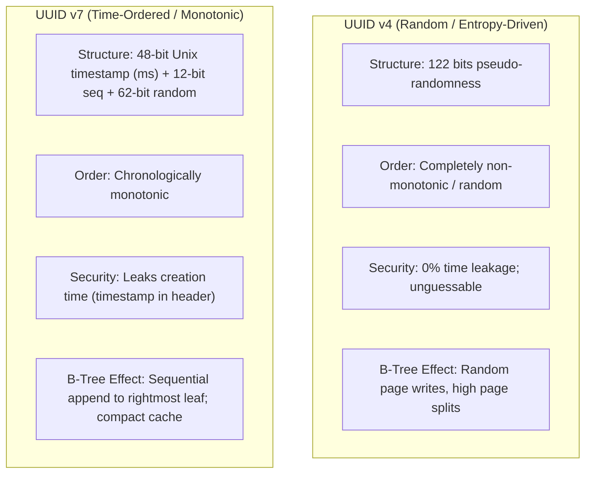

# Amazon Aurora DSQL — Architectural Constraints & Developer Guide

## 1. Overview

Amazon Aurora DSQL is a distributed, serverless relational database offering active-active multi-region availability with wire compatibility for PostgreSQL 16. With full support for transactional foreign keys and native `JSONB` data types, Aurora DSQL combines the operational simplicity of serverless distributed computing with PostgreSQL relational integrity.

---

## 2. Aurora DSQL vs. Single-Instance PostgreSQL

| Feature / Behavior | PostgreSQL 16 | Amazon Aurora DSQL | FamilyLedger Strategy |
| :--- | :--- | :--- | :--- |
| **Storage Architecture** | Heap-based tables | Primary key-ordered distributed B-trees | **Mandatory UUID v4 / v7 PKs** (`gen_random_uuid()`). Sequential/SERIAL PKs cause severe write hot-spots. |
| **Foreign Keys** | DB-enforced (`REFERENCES`) | **Fully Supported** | Use explicit `FOREIGN KEY (parent_id) REFERENCES parent_table(id)` to enforce referential integrity across bounded contexts. |
| **JSON Data Types** | Native `JSON` / `JSONB` | **Fully Supported (`JSONB`)** | Use native `JSONB` for schema-flexible attributes (`permissions`, `metadata`, `extra_params`). |
| **Identity / Serials** | `SERIAL`, `BIGSERIAL` | **Not recommended for PKs** | Use `gen_random_uuid()` for PKs; `GENERATED ALWAYS AS IDENTITY` only for non-PK sequences. |
| **Truncation** | `TRUNCATE TABLE` | **Not supported** | Use `DELETE FROM table WHERE ...` in batches $\le 500$ rows. |
| **Database Triggers** | `CREATE TRIGGER` | **Not supported** | Implement all calculations, validations, and downstream events in Rust code. |
| **Cascading Deletes** | `ON DELETE CASCADE` | **Supported (RESTRICT preferred)** | Prefer `ON DELETE RESTRICT` with explicit application-level soft-deletes (`deleted_at TIMESTAMPTZ NULL`). |
| **DDL Transactions** | Multi-statement DDL | **1 DDL statement per transaction** | Exactly **1 DDL operation per migration file**. Never mix DDL and DML in the same file. |
| **Index Builds** | Blocking `CREATE INDEX` | `CREATE INDEX ASYNC` only | Write index creations in dedicated migration files; monitor status via `SELECT * FROM sys.jobs`. |
| **Write Tx Limit** | Unlimited | **3,000-row transaction limit** | Keep batch writes $\le 500$ rows per transaction with explicit individual commits. |
| **Concurrency Model** | Row-level locking (Pessimistic) | OCC (Optimistic Concurrency Control) | Use `aurora-dsql-sqlx-connector` with `occ` feature to auto-retry commit conflicts (SQLSTATE 40001). |
| **Read Transactions** | Standard `SELECT` | `BEGIN READ ONLY` | Use `BEGIN READ ONLY` on all read endpoints to eliminate OCC conflict overhead. |
| **Pagination** | `OFFSET` / `LIMIT` | Keyset (Cursor) only | `OFFSET` is banned (consumes DPUs proportional to depth). Keyset cursor with `(occurred_at, id) < ($2, $3)`. |
| **Authentication** | Password / IAM | IAM Authentication only | Managed automatically by `aurora-dsql-sqlx-connector` with background token refresh. |

---

## 3. Rust Integration (`aurora-dsql-sqlx-connector`)

We use version **`0.2.2`** of the official AWS connector with SQLx **`0.9.0`**:

```toml
# backend/Cargo.toml
[workspace.dependencies]
sqlx = { version = "0.9.0", features = ["postgres", "runtime-tokio", "tls-rustls-ring", "macros", "migrate", "uuid", "chrono", "rust_decimal", "json"] }
aurora-dsql-sqlx-connector = { version = "0.2.2", features = ["pool", "occ"] }
```

### 3.1 Connection Pool Initialization
```rust
use aurora_dsql_sqlx_connector::pool;
use sqlx::PgPool;

pub async fn create_dsql_pool(endpoint: &str) -> Result<PgPool, sqlx::Error> {
    // Connector auto-detects AWS region, generates IAM auth tokens,
    // and refreshes tokens at 80% of their 15-minute validity window.
    pool::connect(endpoint).await
}
```

### 3.2 OCC Write Retry Pattern
```rust
use aurora_dsql_sqlx_connector::{retry_on_occ, OCCRetryConfig};

pub async fn save_transaction_with_retry(
    pool: &PgPool,
    tx_data: &Transaction,
) -> Result<(), AppError> {
    // Closure must be idempotent because it will be re-executed on OCC conflict
    retry_on_occ(&OCCRetryConfig::default(), || async {
        let mut tx = pool.begin().await?;
        
        sqlx::query!(
            r#"
            INSERT INTO ledger_transactions (
                id, family_id, recorded_by, kind, amount_value, amount_currency,
                destination_amount_value, destination_amount_currency,
                category_id, occurred_at, idempotency_key, tags
            ) VALUES ($1, $2, $3, $4, $5, $6, $7, $8, $9, $10, $11, $12)
            "#,
            tx_data.id,
            tx_data.family_id,
            tx_data.recorded_by,
            tx_data.kind.as_str(),
            tx_data.amount.value,
            tx_data.amount.currency.as_str(),
            tx_data.destination_amount.as_ref().map(|m| m.value),
            tx_data.destination_amount.as_ref().map(|m| m.currency.as_str()),
            tx_data.category_id,
            tx_data.occurred_at,
            tx_data.idempotency_key,
            tx_data.tags // JSONB supported directly via serde_json::Value
        )
        .execute(&mut *tx)
        .await?;
        
        tx.commit().await?;
        Ok(())
    })
    .await
    .map_err(Into::into)
}
```

### 3.3 Read-Only Optimization
```rust
pub async fn list_transactions_read_only(
    pool: &PgPool,
    family_id: Uuid,
) -> Result<Vec<TransactionRow>, sqlx::Error> {
    let mut tx = pool.begin().await?;
    sqlx::query!("SET TRANSACTION READ ONLY").execute(&mut *tx).await?;
    
    let rows = sqlx::query_as!(
        TransactionRow,
        r#"
        SELECT id, family_id, kind, amount_value, amount_currency, occurred_at, tags
        FROM ledger_transactions
        WHERE family_id = $1 AND deleted_at IS NULL
        ORDER BY occurred_at DESC, id DESC
        LIMIT 50
        "#,
        family_id
    )
    .fetch_all(&mut *tx)
    .await?;
    
    tx.commit().await?;
    Ok(rows)
}
```

---

## 4. Primary Key Strategy: UUID v4 vs. UUID v7 (RFC 9562)

In distributed relational databases like Aurora DSQL, selecting the appropriate UUID version for entity identifiers is a critical architectural decision affecting write throughput, index bloat, and cache hit ratios.



### 4.1 Comparison Matrix

| Property | **UUID v4** | **UUID v7 (RFC 9562)** |
| :--- | :--- | :--- |
| **Bit Layout** | `[122 random bits] [4-bit ver] [2-bit var]` | `[48-bit timestamp_ms] [4-bit ver] [12-bit seq/sub-ms] [2-bit var] [62 random bits]` |
| **Sortability** | Unordered (random distribution) | **Monotonically increasing by time** |
| **Time Leakage** | **None** (completely opaque) | Yes (creation timestamp extracted from high 48 bits) |
| **B-Tree Insertion Impact** | ❌ **High Write Amplification**: inserts scatter across random leaf pages, causing frequent page splits and cache evictions in DSQL storage. | ✅ **Zero Fragmentation**: inserts append sequentially to the rightmost leaf pages, maximizing page fill factors and cache locality. |
| **Keyset Cursor Suitability** | ❌ Cannot be used for chronological pagination | ✅ Ideal for tie-breaker in `(occurred_at, id) < ($1, $2)` or direct `id < $cursor` |
| **Guessability / Brute Force** | $2^{122}$ search space (cryptographically unguessable) | Timestamp is predictable; remaining 74 bits provide $2^{74}$ collision resistance |

---

### 4.2 When and Why to Use Each Version

#### When to use **UUID v7**:
* **High-Throughput Financial & Append-Only Logs**:
  * Tables that receive frequent `INSERT` operations and are queried in reverse chronological order (`ORDER BY occurred_at DESC, id DESC`).
  * Using UUID v7 prevents B-tree fragmentation on distributed storage nodes, keeping index pages hot in memory.
* **Cursor-Based Keyset Pagination**:
  * UUID v7 acts as a guaranteed deterministic tie-breaker for rows that share the same timestamp (e.g. bulk batch imports or simultaneous transactions).

#### When to use **UUID v4**:
* **Public & Security-Sensitive Tokens**:
  * Invite tokens (`family_invite_tokens`), password reset tokens, verification links.
  * *Reason*: UUID v7 reveals the exact millisecond when the token was created. An attacker could use this timing information to narrow down brute-force token generation. UUID v4 provides 122 bits of unpredictable entropy.
* **Idempotency Keys**:
  * Client-generated request tokens (`idempotency_key`) sent via HTTP headers to guarantee at-most-once processing.
* **Low-Frequency Static Aggregate Roots**:
  * `family_families`, `family_members`, `ledger_categories`, `payment_accounts`.
  * *Reason*: These tables have very low insert volume (tens of rows per family lifetime), so B-tree write fragmentation is negligible, while opaque random IDs prevent enumeration or timing correlation across tenants.

---

### 4.3 Entity & Table Assignment Matrix

| Table Name | Primary Key Type | Reason / Invariant |
| :--- | :--- | :--- |
| `family_families` | **UUID v4** | Low-frequency root entity; opaque multi-tenant identifier. |
| `family_members` | **UUID v4** | Low-frequency child entity; mapped to Cognito `sub`. |
| `family_invite_tokens` | **UUID v4** | **Security Token**: transmitted in URLs; must prevent timestamp inference. |
| `payment_accounts` | **UUID v4** | Low-frequency entity (typically 2–10 accounts per family). |
| `account_balance_snapshots` | **UUID v7** | Time-series monthly snapshot records. |
| `ledger_categories` | **UUID v4** | Low-frequency dictionary and custom categories. |
| `ledger_transactions` | **UUID v7** | **High-Throughput**: Append-only financial log; time-sortable keyset pagination. |
| `debt_loan_kinds` | **UUID v4** | Static reference dictionary. |
| `debt_loans` | **UUID v4** | Low-frequency lifecycle entity. |
| `debt_loan_payments` | **UUID v7** | **Time-Series**: Append-only payment history linked to transactions. |
| `debt_repayment_plans` | **UUID v7** | Versioned calculation snapshots over time. |
| `recurring_payments` | **UUID v4** | Low-frequency recurring configuration schedule. |
| `recurring_payment_records` | **UUID v7** | **Time-Series**: Historical execution log of recurring payments. |
| `budget_monthly_budgets` | **UUID v4** | Monthly aggregate root (1 row per family per month). |
| `budget_envelopes` | **UUID v4** | Child envelopes linked to monthly budget. |
| `planning_savings_goals` | **UUID v4** | Low-frequency lifecycle planning entity. |
| `goal_contributions` | **UUID v7** | **Time-Series**: Append-only contribution log. |
| `exchange_rates` | **UUID v7** | **Time-Series**: Market exchange rates fetched on a periodic schedule. |

---

### 4.4 Rust Implementation Examples

```rust
use uuid::Uuid;

// Generating UUID v7 for time-series / transaction entity
pub fn create_transaction_id() -> Uuid {
    Uuid::now_v7()
}

// Generating UUID v4 for security tokens & aggregate roots
pub fn create_invite_token_id() -> Uuid {
    Uuid::new_v4()
}
```
