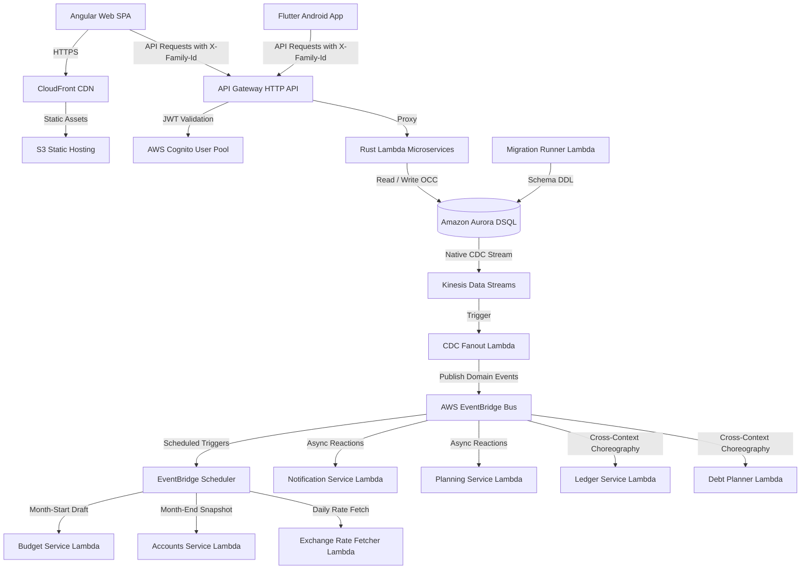

# System Architecture Overview — FamilyLedger

## 1. Cloud Architecture

FamilyLedger is built entirely on a serverless, event-driven AWS architecture designed for high availability, zero idle costs, and strong data consistency.

---

## 2. Infrastructure Components

### 2.1 Edge & Frontend Hosting
* **Amazon CloudFront**: Global CDN terminating HTTPS, caching frontend bundles, and enforcing SPA routing fallbacks (routing 404s to `index.html`).
* **Amazon S3**: Private bucket storing compiled Angular artifacts with CloudFront Origin Access Control (OAC).

### 2.2 API & Authentication
* **Amazon API Gateway (HTTP API)**: High-performance, low-latency API gateway routing requests to backend Lambdas.
* **AWS Cognito**: Managed user directory issuing signed JWT tokens. The client supplies `X-Family-Id` to select the active family workspace, which Lambda authorization middleware validates against `family_members`.

### 2.3 Compute (Rust Microservices)
* **AWS Lambda (ARM64 / Graviton)**: Zero-idle microservices written in Rust using Axum and compiled via `cargo-lambda` for sub-200ms cold starts.

### 2.4 Database & Streaming
* **Amazon Aurora DSQL**: Distributed serverless PostgreSQL-compatible database with key-ordered storage and Optimistic Concurrency Control (OCC).
* **Amazon Kinesis Data Streams**: Receives native Change Data Capture (CDC) events directly from Aurora DSQL with zero polling.
* **AWS EventBridge**: Enterprise event bus distributing semantic domain events (`TransactionRecorded`, `LoanPaidOff`, `BudgetDraftCreated`, `ExchangeRatesRefreshed`) across bounded contexts.

---

## 3. Microservices Inventory

| Service Name | Primary Responsibility | Trigger Sources |
| :--- | :--- | :--- |
| `family_service` | Workspace, members, invite tokens, role permissions | API Gateway |
| `accounts_service` | Payment accounts (cards, bank, cash), monthly balance snapshots | API Gateway, EventBridge Scheduler |
| `ledger_service` | Transactions, amendments/reversals, P2P transfers, cash withdrawals | API Gateway, EventBridge (`LoanPaymentRecorded`) |
| `debt_planner_service` | Loans, custom loan kinds, payments, avalanche/snowball plan generation | API Gateway, EventBridge (`LoanPaymentLedgerized`, CDC) |
| `recurring_service` | Fixed bills, subscriptions, loan-bound insurance, committed amounts | API Gateway, EventBridge (`LoanPaidOff`) |
| `budget_service` | Monthly budgets, draft approval flow, envelope tracking, alert thresholds | API Gateway, EventBridge Scheduler, EventBridge (CDC) |
| `planning_service` | Goal-based savings timelines and contribution tracking | API Gateway, EventBridge |
| `notification_service` | Web push & FCM push notifications | EventBridge, Scheduler |
| `exchange_rate_fetcher` | Daily rate fetching (BNM / ECB Frankfurter) $\rightarrow$ upserts `exchange_rates` | EventBridge Scheduler (daily) |
| `cdc_fanout` | Ingests DSQL CDC from Kinesis $\rightarrow$ filters and publishes semantic events to EventBridge | Kinesis Data Stream |
| `migrate_runner` | Runs embedded SQLx schema migrations on deploy | Direct Invoke (CI/CD) |

---

## 4. Scheduler-Driven Automated Flows

| Schedule | Target Service | Action Description |
| :--- | :--- | :--- |
| **1st of month, 00:05 UTC** | `budget_service` | Creates `MonthlyBudget` in `Draft` status, pre-seeds committed envelopes from active `recurring_payments` and loan minimums, emits `BudgetDraftCreated` (push notification to Owner). |
| **Last day of month, 23:00 UTC** | `accounts_service` | Iterates over active `payment_accounts`, computes final monthly closing balances from ledger transactions, and writes `account_balance_snapshots`. |
| **Daily, 08:00 UTC** | `exchange_rate_fetcher` | Fetches latest official rates from National Bank of Moldova (BNM) or configured provider, upserts `exchange_rates`, and emits `ExchangeRatesRefreshed`. |
