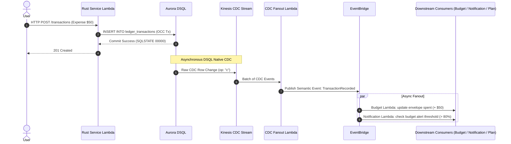
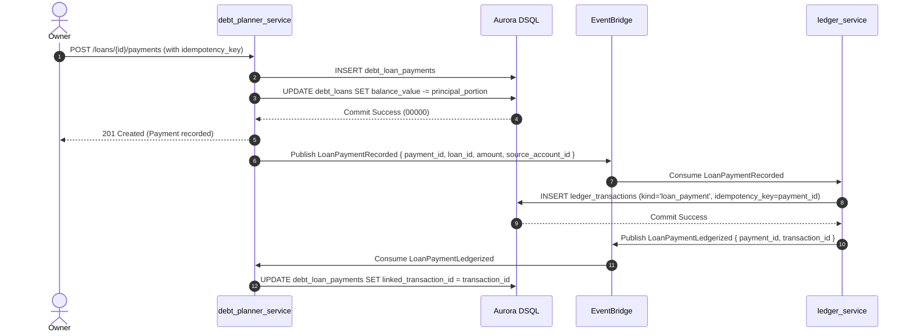

# Event Storming & Domain Events Catalog — FamilyLedger

## 1. Domain Event Flow (Standard Ledger Transaction)

---

## 2. Domain Events Catalog

| Domain Event | Originating Context | Trigger Condition | Downstream Consumers & Side-Effects |
| :--- | :--- | :--- | :--- |
| `FamilyCreated` | Identity & Family | User creates workspace | Seeds default ledger categories |
| `MemberJoined` | Identity & Family | Invite accepted | Refreshes family member cache |
| `MemberRoleChanged` | Identity & Family | Owner modifies role/permissions | Updates active authorization cache |
| `MemberRemoved` | Identity & Family | Member soft-deleted | Revokes active sessions |
| `AccountRegistered` | Payment Cards & Accounts | New account added | Initializes account balance tracking |
| `AccountBalanceSnapshotted` | Payment Cards & Accounts | Month-end EventBridge Scheduler | Computes and stores closing balance in `account_balance_snapshots` |
| `TransactionRecorded` | Ledger Core | Expense/Income/Transfer recorded | Updates budget envelope `spent`; triggers notifications |
| `TransactionReversed` | Ledger Core | `POST /transactions/{id}/amend` | Reverses prior transaction effect; links new corrected entry via `amendment_of_id` |
| `TransactionDeleted` | Ledger Core | Soft-delete transaction | Reverses envelope `spent` allocation |
| `RecurringPaymentRegistered` | Recurring Payments | New bill/subscription added | Recalculates total committed obligations; pre-seeds draft budget envelopes |
| `RecurringPaymentRecorded` | Recurring Payments | Bill paid | Advances `next_due_date` by frequency; links to ledger transaction |
| `RecurringPaymentMissed` | Recurring Payments | Due date passed +1 day | Triggers push notification reminder |
| `LoanRegistered` | Debt Planner | New loan added | Automatically triggers `RepaymentPlanCalculator` projection |
| `LoanKindCreated` | Debt Planner | Family creates custom kind | Refreshes loan kind selection cache |
| `LoanPaymentRecorded` | Debt Planner | Loan payment made | Reduces loan balance; checks payoff; emits to EventBridge for ledgerization |
| `LoanPaymentLedgerized` | Ledger Core | `LoanPaymentRecorded` consumed | Inserts `loan_payment` ledger transaction; updates `debt_loan_payments.linked_transaction_id` |
| `CreditCardSpendingUpdatedLoanBalance` | Debt Planner | CDC on `ledger_transactions` | Increments `debt_loans.balance_value` for linked credit cards (`kind != 'loan_payment'`) |
| `LoanPaidOff` | Debt Planner | Loan balance reaches 0 | Regenerates plan, rolls freed payment to next debt; notifies Owner to review linked insurance |
| `BudgetDraftCreated` | Budget & Limits | 1st of month Scheduler | Creates `MonthlyBudget` in `Draft` status; delivers push notification to Owner |
| `BudgetApproved` | Budget & Limits | Owner approves draft budget | Transitions status to `Active`; locks envelope limits |
| `BudgetAlertTriggered` | Budget & Limits | Spending exceeds alert threshold (e.g. 80%) | Delivers push notification warning |
| `GoalCreated` | Future Planning | New savings goal registered | Calculates required monthly contribution timeline |
| `GoalContributionRecorded` | Future Planning | Deposit recorded against goal | Recomputes `current_saved` and `OnTrack`/`Behind` status |
| `ExchangeRatesRefreshed` | Infrastructure | Daily Scheduler fetch | Upserts latest rates in `exchange_rates`; triggers recalculation of home-currency totals |

---

## 3. CDC Fanout & Idempotency Rules

1. **At-Least-Once Delivery**: Kinesis Data Streams and EventBridge deliver events with at-least-once semantics.
2. **Deduplication Key**: All CDC consumers must deduplicate events using `txId + table + PK`.
3. **Soft-Delete Payload Preservation**: Because hard deletes in DSQL CDC omit the deleted row's prior state, business entities MUST be soft-deleted (`deleted_at TIMESTAMPTZ`) to retain full context in CDC events.
4. **CDC Exclusion for Loan Payments**: CDC handlers syncing credit card loan balances must ignore `ledger_transactions` with `kind IN ('loan_payment', 'reversal')` to prevent double-decrementing or looping balance updates.

---

## 4. Event Flow: Loan Payment → Ledger Choreography

