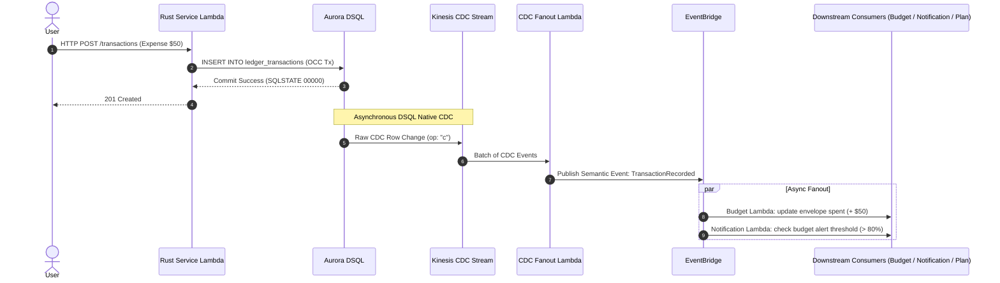

# Event Storming & Domain Events Catalog — FamilyLedger

## 1. Domain Event Flow

---

## 2. Domain Events Catalog

| Domain Event | Originating Context | Trigger Condition | Downstream Consumers & Side-Effects |
| :--- | :--- | :--- | :--- |
| `FamilyCreated` | Identity & Family | User creates workspace | Seeds default ledger categories |
| `MemberJoined` | Identity & Family | Invite accepted | Refreshes family member cache |
| `AccountRegistered` | Payment Cards | New account added | Initializes account balance tracking |
| `TransactionRecorded` | Ledger Core | Expense/Income recorded | Updates account balance; increments budget envelope `spent` |
| `TransactionDeleted` | Ledger Core | Soft-delete transaction | Reverses account balance change; decrements budget envelope `spent` |
| `RecurringPaymentRegistered` | Recurring Payments | New bill/subscription | Updates total committed obligations; pre-seeds budget envelope |
| `RecurringPaymentRecorded` | Recurring Payments | Bill paid | Advances `next_due_date` by period; links to ledger transaction |
| `RecurringPaymentMissed` | Recurring Payments | Due date passed +1 day | Triggers push notification reminder |
| `LoanRegistered` | Debt Planner | New loan added | Automatically regenerates `RepaymentPlan` |
| `LoanPaymentRecorded` | Debt Planner | Payment made | Reduces loan balance; checks for loan payoff |
| `LoanPaidOff` | Debt Planner | Loan balance hits 0 | Regenerates `RepaymentPlan`, rolling freed payment to next loan |
| `BudgetAlertTriggered` | Budget & Limits | Spending exceeds 80% | Delivers push notification warning |
| `GoalCreated` | Future Planning | New goal registered | Calculates required monthly contribution |

---

## 3. CDC Fanout & Idempotency Rules

1. **At-Least-Once Delivery**: Kinesis Data Streams delivers events with at-least-once semantics.
2. **Deduplication Key**: All CDC consumers must deduplicate events using `txId + table + PK`.
3. **Soft-Delete Payload Preservation**: Because hard deletes in DSQL CDC omit the deleted row's prior state, business entities MUST be soft-deleted (`deleted_at TIMESTAMPTZ`) to retain full context in CDC events.

