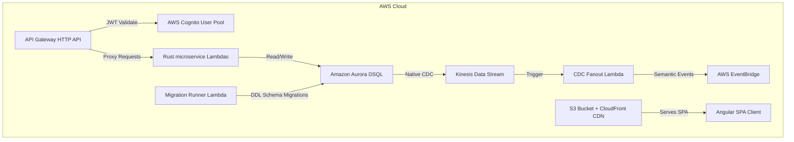

# FamilyLedger — Sprint 1 Execution Plan (Infrastructure & Foundation)

## Sprint 1 Goal
Establish the core serverless cloud infrastructure on AWS, initialize the Rust multi-crate workspace, configure the Amazon Aurora DSQL database cluster, set up the CDC (Change Data Capture) fanout stream, implement the Database Migration Runner Lambda, and deploy the initial schema migrations.

**Duration**: 2 Weeks (10 Working Days)

---

## Technical Overview



---

## Detailed Task Breakdown

### Phase 1: AWS Serverless Infrastructure Provisioning (Days 1–3)

#### Task 1.1: IAM & CloudFormation/SAM Template Setup
* **Objective**: Create the Infrastructure-as-Code (IaC) templates (AWS SAM / CloudFormation) to model the environment cleanly.
* **Details**:
  * Define AWS Cognito User Pool, Cognito App Client, and OAuth scopes.
  * Define API Gateway HTTP API with a JWT Authorizer pointing to the Cognito User Pool.
  * Define S3 Bucket for Angular static hosting, configured for private access with CloudFront Origin Access Control (OAC).
  * Configure CloudFront Distribution to serve files from the S3 bucket with SPA routing fallbacks (routing 404s back to `index.html`).

#### Task 1.2: Database & Event Stream Provisioning
* **Objective**: Set up Aurora DSQL serverless instance and hook up Change Data Capture (CDC) pipeline.
* **Details**:
  * Provision an Amazon Aurora DSQL Cluster. Establish endpoint configurations.
  * Enable CDC on the Aurora DSQL cluster, targeting a new Amazon Kinesis Data Stream (on-demand mode).
  * Configure IAM Roles allowing the microservices and migration runner to log in to DSQL via IAM authentication tokens.
  * Create a placeholder Lambda function (`cdc_fanout`) triggered by the Kinesis stream.

---

### Phase 2: Rust Workspace Initialization (Days 4–5)

#### Task 2.1: Folder & Cargo Workspace Structure
* **Objective**: Initialize the multi-crate Rust workspace matching the Clean Architecture/DDD structure.
* **Structure to create**:
  ```
  home-harmony/
  ├── Cargo.toml                  # Workspace definition
  ├── domain/                     # Pure domain logics crate
  │   ├── Cargo.toml
  │   └── src/lib.rs
  ├── infrastructure/             # DB & External integration adapters
  │   ├── Cargo.toml
  │   └── src/lib.rs
  ├── api/                        # Shared Axum middlewares & responses
  │   ├── Cargo.toml
  │   └── src/lib.rs
  └── lambdas/                    # Binary targets compiled for AWS Lambda
      └── migrate_runner/         # DB Migration runner entry point
          ├── Cargo.toml
          └── src/main.rs
  ```

#### Task 2.2: Add Workspace Dependencies
* **Objective**: Set up base dependencies in workspace crates to enforce consistent versioning.
* **Core dependencies**:
  * `sqlx` (v0.7) with `postgres`, `runtime-tokio-rustls`, `uuid`, `chrono`, `rust_decimal`, `migrate` features.
  * `aurora-dsql-sqlx-connector` (v0.1.2) for automatic IAM auth refresh and OCC retry logic.
  * `tokio` (v1) with full features.
  * `rust_decimal` (v1) with `serde-with-str` for float-free currency calculations.
  * `uuid` (v1) with `v4`, `v7`, and `serde` features.

---

### Phase 3: Database Schema Migrations Setup (Days 6–8)

> [!IMPORTANT]
> **Aurora DSQL Migration Rules**:
> 1. DSQL allows **exactly one DDL statement per transaction**. 
> 2. Mixing DDL (e.g. `CREATE TABLE`) and DML (e.g. `INSERT`) is strictly forbidden.
> 3. Indices must be built asynchronously using `CREATE INDEX ASYNC` in separate migration files.
> 4. Do not use foreign keys (`REFERENCES`), auto-increment sequence serials (`SERIAL`), or JSONB columns.

#### Task 3.1: Create Migration Files
We will generate 25 individual migration files under `migrations/` to conform to the single DDL statement per file constraint:

```
migrations/
├── 20260616000001_create_family_families.sql
├── 20260616000002_create_family_members.sql
├── 20260616000003_create_family_invite_tokens.sql
├── 20260616000004_create_cards_accounts.sql
├── 20260616000005_create_ledger_categories.sql
├── 20260616000006_create_ledger_transactions.sql
├── 20260616000007_create_debt_loans.sql
├── 20260616000008_create_debt_loan_payments.sql
├── 20260616000009_create_debt_repayment_plans.sql
├── 20260616000010_create_recurring_payments.sql
├── 20260616000011_create_recurring_payment_records.sql
├── 20260616000012_create_budget_monthly_budgets.sql
├── 20260616000013_create_budget_envelopes.sql
├── 20260616000014_create_planning_savings_goals.sql
├── 20260616000015_idx_members_family.sql
├── 20260616000016_idx_accounts_family.sql
├── 20260616000017_idx_tx_family_time.sql
├── 20260616000018_idx_tx_account_src.sql
├── 20260616000019_idx_tx_account_dst.sql
├── 20260616000020_idx_loans_family.sql
├── 20260616000021_idx_loan_payments.sql
├── 20260616000022_idx_recurring_family.sql
├── 20260616000023_idx_recurring_due.sql
├── 20260616000024_idx_recurring_records.sql
└── 20260616000025_idx_goals_family.sql
```

*Example contents for Table Creation File (`20260616000006_create_ledger_transactions.sql`)*:
```sql
CREATE TABLE ledger_transactions (
  id                      UUID PRIMARY KEY DEFAULT gen_random_uuid(),
  family_id               UUID          NOT NULL,
  recorded_by             UUID          NOT NULL,
  kind                    VARCHAR(20)   NOT NULL CHECK (kind IN ('income','expense','transfer','cash_withdrawal')),
  amount_value            NUMERIC(19,4) NOT NULL,
  amount_currency         CHAR(3)       NOT NULL,
  source_account_id       UUID,
  destination_account_id  UUID,
  category_id             UUID          NOT NULL,
  tags                    TEXT          NOT NULL DEFAULT '[]', -- Stored as text, cast to jsonb in queries
  description             TEXT,
  occurred_at             TIMESTAMPTZ   NOT NULL,
  created_at              TIMESTAMPTZ   NOT NULL DEFAULT now(),
  idempotency_key         UUID          NOT NULL UNIQUE,
  deleted_at              TIMESTAMPTZ
);
```

*Example contents for Index Creation File (`20260616000017_idx_tx_family_time.sql`)*:
```sql
-- DSQL requires ASYNC index builds. They execute in the background.
CREATE INDEX ASYNC idx_tx_family_time ON ledger_transactions (family_id, occurred_at, id)
  INCLUDE (kind, amount_value, amount_currency, category_id, source_account_id, destination_account_id)
  WHERE deleted_at IS NULL;
```

---

### Phase 4: Migration Runner Lambda Implementation (Days 8–9)

#### Task 4.1: Write the Rust Migration Runner Lambda
* **Objective**: Write a Lambda binary using `lambda_runtime` that connects to Aurora DSQL and runs `sqlx::migrate!()` to apply embedded SQL migrations at runtime.
* **Code Implementation (`lambdas/migrate_runner/src/main.rs`)**:
```rust
use lambda_runtime::{run, service_fn, Error, LambdaEvent};
use serde::{Deserialize, Serialize};
use aurora_dsql_sqlx_connector::pool;

static MIGRATOR: sqlx::migrate::Migrator = sqlx::migrate!("../../migrations");

#[derive(Deserialize)]
struct Request {}

#[derive(Serialize)]
struct Response {
    message: String,
    applied_count: usize,
}

#[tokio::main]
async fn main() -> Result<(), Error> {
    run(service_fn(handler)).await
}

async fn handler(_event: LambdaEvent<Request>) -> Result<Response, Error> {
    let dsql_endpoint = std::env::var("DSQL_ENDPOINT")
        .map_err(|_| Error::from("DSQL_ENDPOINT env variable is missing"))?;
        
    println!("Connecting to Aurora DSQL...");
    let pool = pool::connect(&dsql_endpoint).await?;
    
    println!("Running migrations...");
    MIGRATOR.run(&pool).await?;
    
    let applied = MIGRATOR.iter().count();
    println!("Success. Applied {} migrations.", applied);

    Ok(Response {
        message: "Migrations executed successfully".to_string(),
        applied_count: applied,
    })
}
```

---

### Phase 5: Testing, Local Validation & Deployment (Day 10)

#### Task 5.1: Local Integration Testing setup
* **Objective**: Set up a local test database using PostgreSQL 16 via Docker/Testcontainers to validate the schema.
* **Details**:
  * Create a test utility in `infrastructure/src/test_utils.rs` that starts a container, runs the embedded SQL migrations, and exposes a connection pool.
  * Ensure that local PostgreSQL can apply all 25 migration files without throwing exceptions.

#### Task 5.2: Compilation & Deploy
* **Objective**: Compile the Rust binary and deploy the CloudFormation/SAM stack.
* **Details**:
  * Execute `cargo lambda build --release --arm64` to compile the migration runner.
  * Package and deploy the IaC templates to the AWS target environment.
  * Trigger the `familyledger-migrate` Lambda function.
  * Check AWS CloudWatch logs to verify database connectivity and successful schema creation.
  * Verify background index creation status via SQL Client:
    ```sql
    SELECT * FROM sys.jobs WHERE status = 'RUNNING' OR status = 'FAILED';
    ```

---

## Sprint 1 Definition of Done (DoD)
- [ ] AWS infrastructure components (Cognito, API Gateway, S3, CloudFront, Aurora DSQL) are successfully provisioned.
- [ ] Kinesis stream is active and receives CDC events from Aurora DSQL.
- [ ] Rust Cargo workspace compiles cleanly with zero warnings/errors.
- [ ] Local database migration checks run successfully against PostgreSQL.
- [ ] The Migration Runner Lambda compiles, deploys, and executes successfully on AWS.
- [ ] Database contains all 14 schema tables and 11 async indexes verified via active schema checks.
